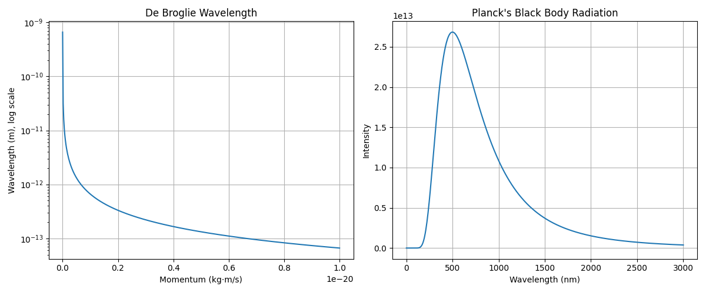
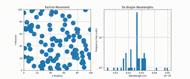
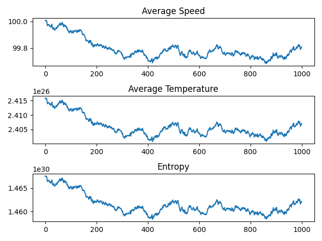
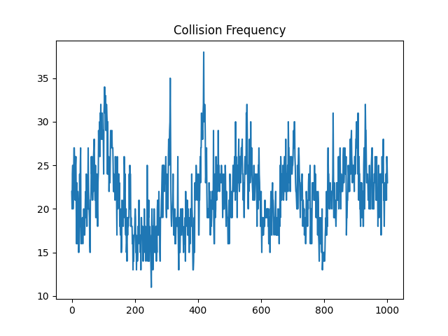

# Thermodynamics movement and the de Broglie wavelength of a particle

## Introduction
This project simulates the behavior of particles in a two-dimensional box. The simulation considers various physical properties and interactions, including entropy, temperature, collisions, and the de Broglie wavelength of the particles. The simulation is based on the principles of statistical thermo-dynamics and quantum mechanics.

**TL;DR:** The simulation shows the movement of particles in a box, their temperature, entropy, and the de Broglie wavelength distribution. Click [here](#results) to see the results.

## de Broglie wavelength

The de Broglie wavelength is a fundamental concept in quantum mechanics that describes the wave-like behavior of particles. The wavelength is inversely proportional to the momentum of the particle and is related to the particle's kinetic energy. The de Broglie wavelength is a key concept in quantum mechanics and is used to describe the wave-particle duality of matter.

In this simulation, the de Broglie wavelength of the particles is calculated based on their kinetic energy and momentum. The de Broglie wavelength is used to determine the quantum mechanical behavior of the particles and is related to their temperature and entropy. The simulation provides a visual representation of the de Broglie wavelength distribution of the particles and demonstrates the wave-like behavior of the particles in the box.

$$ \lambda = \frac{h}{p} = \frac{h}{\sqrt{2mE}} $$

where:
- $\lambda$ is the de Broglie wavelength
- $h$ is the Planck constant
- $p$ is the momentum of the particle
- $m$ is the mass of the particle
- $E$ is the kinetic energy of the particle

Also, below is the formula for the black body radiation:

$$ \frac{dE}{d\lambda} = \frac{8\pi hc}{\lambda^5} \frac{1}{e^{\frac{hc}{\lambda kT}} - 1} $$

where:
- $dE$ is the energy emitted per unit wavelength
- $d\lambda$ is the wavelength interval
- $h$ is the Planck constant
- $c$ is the speed of light
- $\lambda$ is the wavelength
- $k$ is the Boltzmann constant
- $T$ is the temperature



## Installation

To run this project, you need to have Python installed along with the following libraries:

- NumPy
- Matplotlib

You can install the required libraries using pip:

```sh
pip install numpy matplotlib
```

## Usage

To run the simulation, execute the simulation.py script:

```sh
python run_simulation.py
```

Parameters such as the number of particles, box size, initial temperature, dissipation constant, and simulation time can be adjusted in the script.

> Make sure to create the `outputs` directory before running the simulation.

```sh
mkdir outputs
```

> Note that the simulation may take some time to run, depending on the number of particles and simulation time.

## Calculations

The simulation used the same logics as the previous project, but with the addition of the de Broglie wavelength calculation. Click [here](https://github.com/Eric-xin/entropy_simulation#physics-considerations) to see the physics behind the simulation.

## Results

Below is a sample output of the simulation:

**Particle Simulation and de Broglie wavelengths distribution:**


<!--  -->

The simulation video is also available [here](outputs-sample/particles_simulation.mp4).

**Average Speed, Temperature, and Entropy:**



**Collision Frequency:**



## Note
*Currently the model has not been fully quantized. Although the model is based on the principles of statistical mechanics and thermodynamics, the simulation is not a direct representation of a real-world system. The model can be further refined by considering additional factors such as intermolecular forces, particle interactions, and external fields.*

## License

This project is licensed under the MIT License - see the [LICENSE](LICENSE) file for details.

## Contact

For any questions or suggestions, feel free to contact me at [me@ericxin.eu](mailto:me@ericxin.eu).